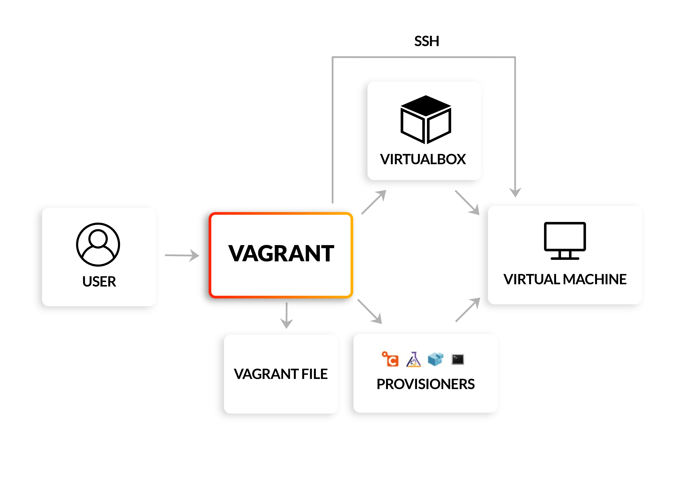

# HOW TO INSTALL VAGRANT ON VirtualBox

HashiCorp Vagrant is an open-source tool that simplifies the creation and management of virtual development environments
By providing a unified workflow, Vagrant allows us to easily create and share reproducible development environments, eliminating the “works on my machine” problem. Vagrant achieves this by abstracting the underlying infrastructure details, such as virtualization providers (e.g., Hyper-V, VirtualBox, VMware), and providing a declarative configuration file, known as a Vagrantfile, that specifies the desired environment setup.

# 1. Install VirtualBox and Vagrant
You can install virtualBox here:
https://www.virtualbox.org/wiki/Downloads

You can install Vagrant here:
https://developer.hashicorp.com/vagrant/install

# 2. Architecture

# 3. Configure Vagrant deloy vm on VirtualBox

